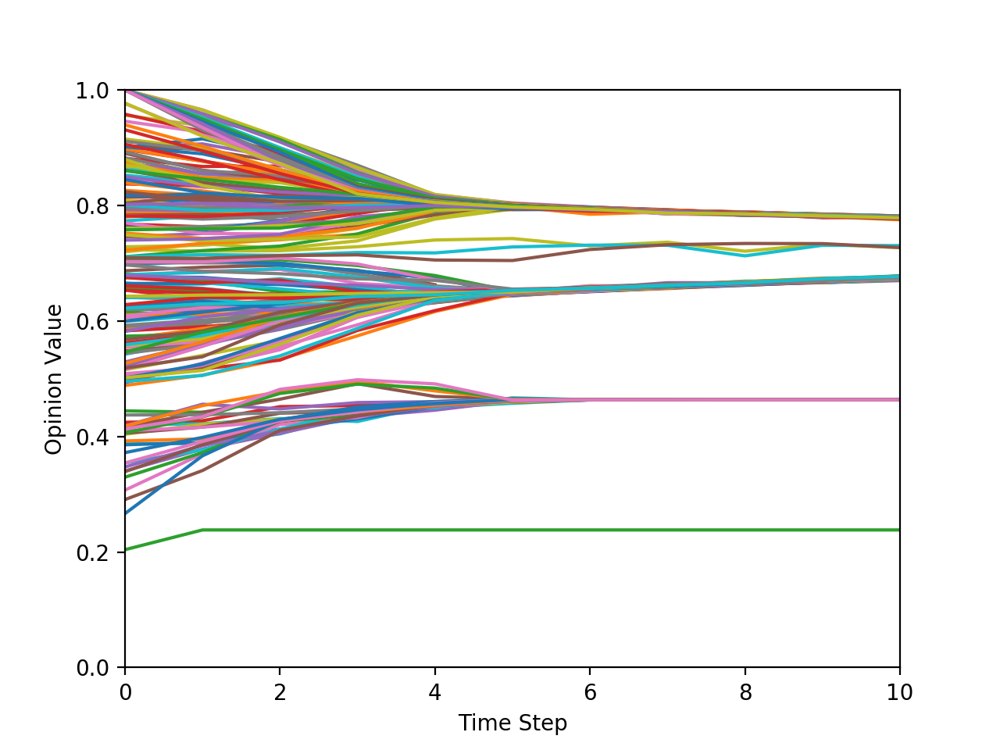
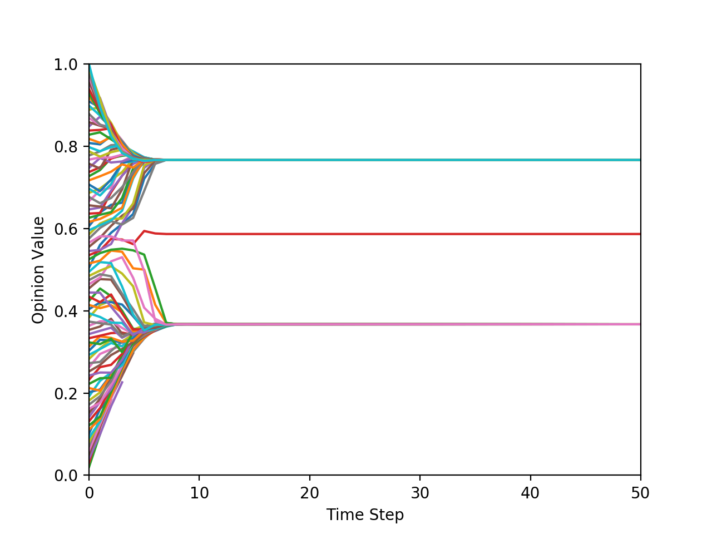
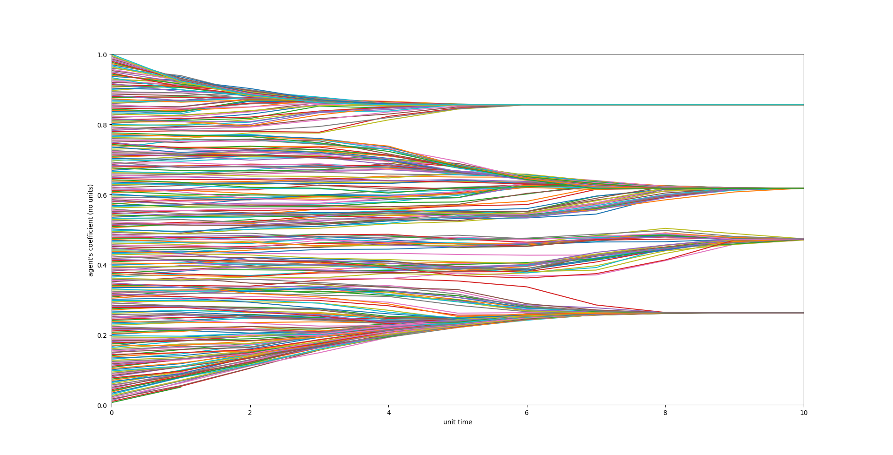
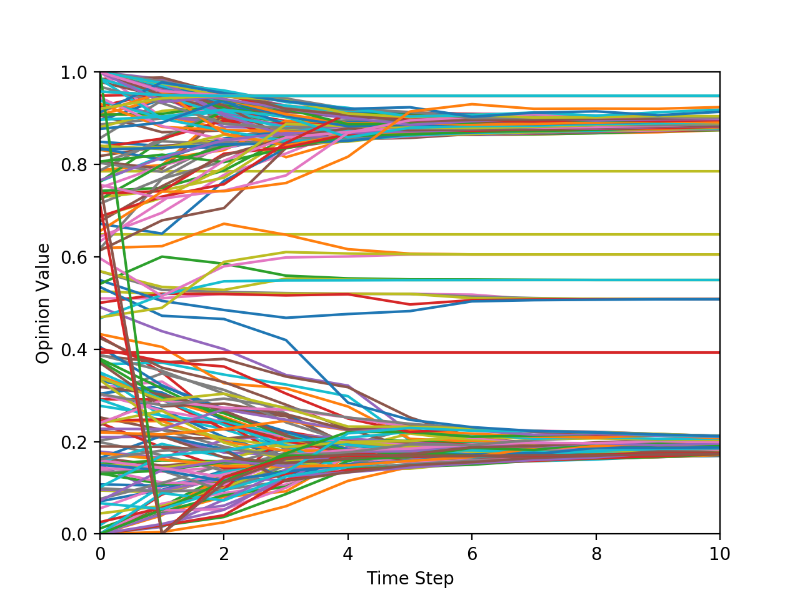
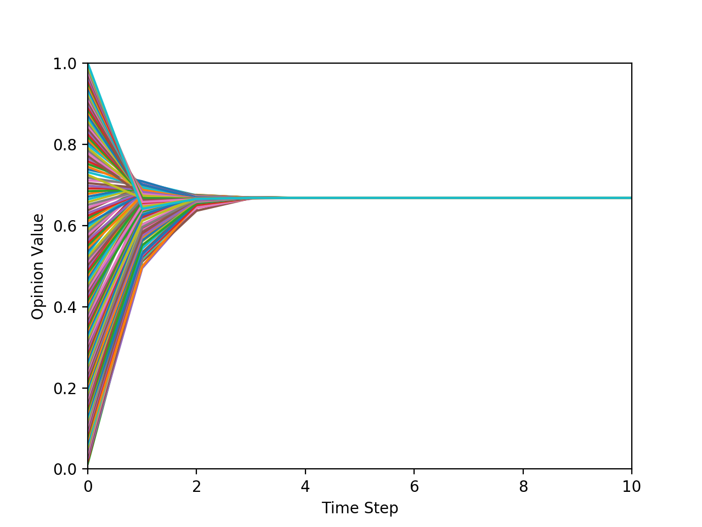

# PolarizationModel

The models used in this program have been taken from: ["Opinion Dynamics and
Bounded Confidence Models, Analysis, and Simulation" by Rainer Hegselmann 
and Ulrich Krause (2002)](http://jasss.soc.surrey.ac.uk/5/3/2.html).

In this program we aim to simulate different models of opinion formation 
within an interacting population. There is an extensive collection of research
exploring such models so we have chosen a few to show how polarization, the 
formation of stable subgroups, can occur in a population.

We consider each individual, or *agent*, in 
the population to have some *opinion* between 0 and 1 which they update based 
on the opinions of all other agents in the population. To normalize this
updating each agent has a *weight* associated with all other agents such that
their sum is 1. With this model as a baseline, we add complexity to create 
three more models:
1. Social susceptibility model
2. Bounded confidence model
3. Bounded confidence and proximity model

Model (1) includes an additional weight or *susceptibility* between 0 and 1
which represents how influenced they are by all other agents' opinions. Model
(2) includes a *bounded confidence* such that an agent will ignore another's 
opinion if the difference of their opinons is greater than the bounded
confidence. Model (3) includes bounded confidence with the additional
*proximity limit*. This aims to simulate a senario where agents only update
their opinion based off of agents who neighbor them (are within the proximity 
limit).
                                                     
Running this program will allow the user to choose the model used, initial 
opinion distribution, and the parameters associated with each model. It will
return a plot showing the evolution of all agents opinions.

The cli program starts off with a tutorial, which will prompt the user to choose the amount of agents and the number of time stamps (they are the same number.) Next, the user will be prompt to choose the susceptibility and the value of proximity. Each of these values have an effect on whether or not there will be any converges or polarization in the opinion as shown in the examples below.

## Examples Plots

This is an example of a normally distributed opinion where the number of population is 200.

The same as above with a size of 100.

